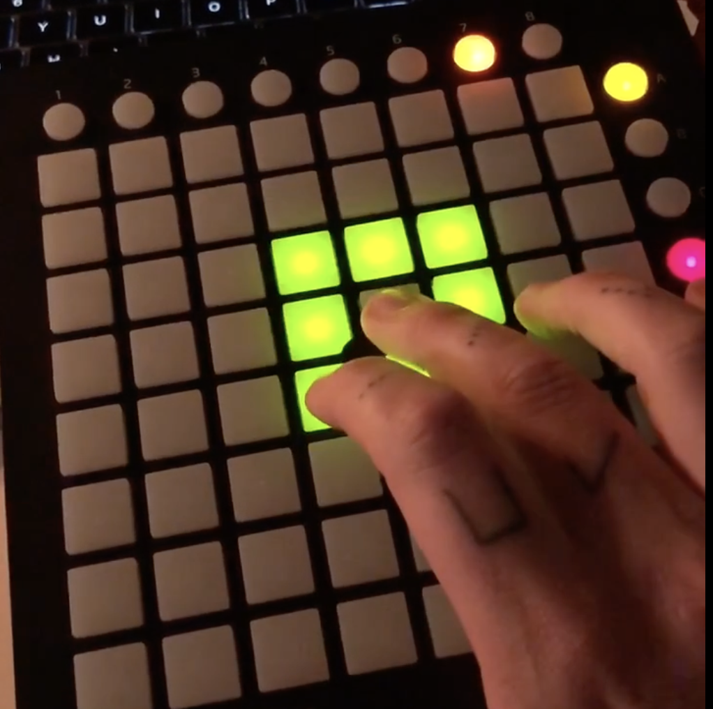

# LaunchpadMini-SC

 

A simple interface for the Launchpad Mini controller to be used in SuperCollider. It allows setting pad colors and easily registering callbacks.

NOTE: It's only tested with the MK1 version, but it should work with the MK2 version as well. Please let me know if it doesn't.

## Installation

### Quark

LaunchpadMini-SC is available as a Quark. To install it, run the following in SuperCollider:

```supercollider
Quarks.install("https://github.com/madskjeldgaard/launchpadmini-sc");
```

## Examples

### Callback for button on the grid

```supercollider
l = l ? LaunchpadMiniMk1.new();

l.setFunc(x: 3, y: 5, func: {|...args|
    var launchpad = args[0];
    var onOrOff = args[1];
    var x = args[2];
    var y = args[3];
    var velocity = args[4];

    // Set the color of this pad
    if(onOrOff == \on, {
        launchpad.setColor(x: x, y: y, color: 127);
    }, {
        launchpad.setColor(x: x, y: y, color: 0);
    });

    "You just pressed a button on the grid. Here are all the arguments you get in a callback:".postln;
    args.postln;
});
```

### Callback for button on top row (the numbered buttons)

```supercollider
l = l ? LaunchpadMiniMk1.new();

l.setFunc(x: 3, func: {|...args|
    "You just pressed a button on the top row. Here are all the arguments you get in a callback:".postln;
    args.postln;
});
```

### Callback for button on right column (the lettered buttons)

```supercollider
l = l ? LaunchpadMiniMk1.new();

l.setFunc(y: 2, func: {|...args|
    "You just pressed a button on the right column. Here are all the arguments you get in a callback:".postln;
    args.postln;
});
```

### Setting colors of pads

Colors are 0-127. The launchpad has a slightly weird way of dealing with this – in the course of the range, each color is made brighter, and then turned off, so some of these values will actually turn off the color.

```supercollider
l = l ? LaunchpadMiniMk1.new();

// Set the color of a pad
l.setColor(x: 3, y: 5, color: 127);

// There's also a special function for setting the colors around a pad
l.setColorAroundPad(x: 3, y: 5, color: 39, distance: 2);

// Set the color of a pad in the top row
l.setColorTop(x: 3, color: 55);

// Set the color of a pad in the right column
l.setColorSide(y: 2, color: 100);

// Set all colors
l.setAllColors(color: 11);
```

### Messing with colors on the Launchpad Mini in a routine

```supercollider
l = LaunchpadMiniMk1.new()

// Randomize colors
(
r{
    loop{
        // Randomize color of all 8x8 grid buttons
        8.do{|x|
            8.do{|y|
                l.setColor(x,y,rrand(0,127));
                (rrand(0.001,0.01)).wait;
            }
        }


    }
}.play;
)
```
